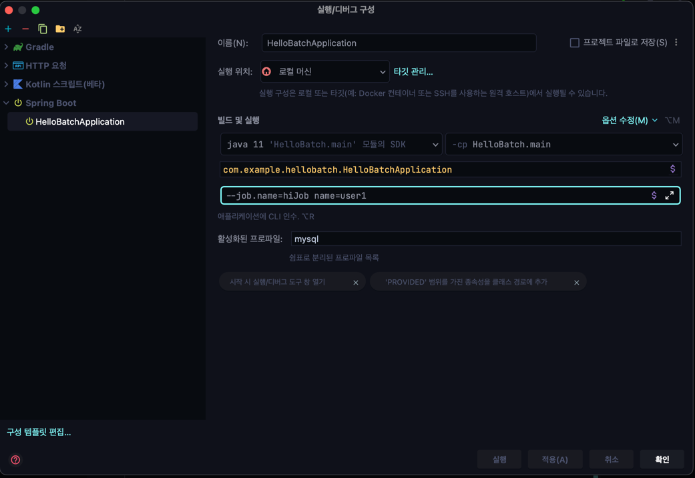

## 1. JobLauncherApplicationRunner

- 스프링 배치 작업을 시작하는 ApplicationRunner 로서 BatchAutoConfiguration 에서 생성됨
- 스프링부트에서 제공하는 ApplicationRunner 의 구현체로 애플리케이션이 정상적으로 구동되지마자 실행됨
- 기본적으로 빈으로 등록된 모든 job 을 실행시킨다

## 2. BatchProperties

- 스프링 배치의 환경설정 클래스
- 잡 이름, 스키마 초기 설정, 테이블 prefix 등의 값을 설정

```yml
spring:
  batch:
    job:
      names: ${job.name:NONE}
      initialize-schema: NEVER
      tablePrefix: SYSTEM
```

## 3. 잡 실행 옵션

- 지정한 배치잡만 실행하도록 할 수 있음
- `spring.batch.job.names: ${job.name:NONE}`
- 애플리케이션 실행 시 프로그램 인수로 잡 이름을 입력한다
    - `--job.name=helloJob`
    - `--job.name=helloJob,simpleJob` (하나 이상의 잡을 실행할 경우 쉼표로 구분해서 입력)
      


