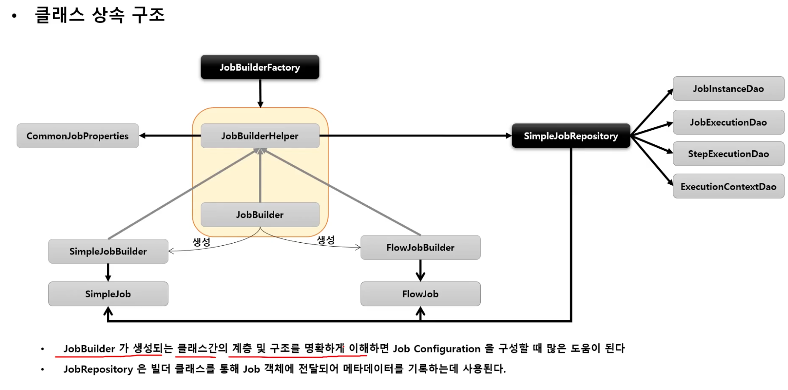
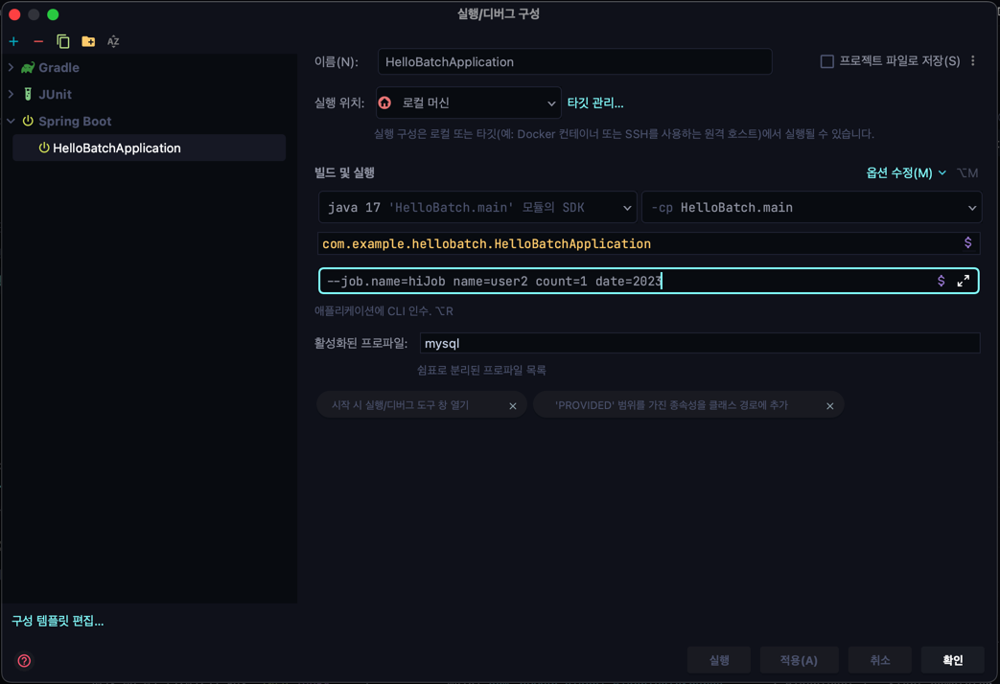

# JobBuilderFactory / JobBuilder

> 스프링 배치는 잡과 스텝을 쉽게 생성 및 설정할 수 있는 유틸 클래스들을 제공한다.

## JobBuilderFactory

- JobBuilder 를 생성하는 팩토리 클래스로서 `get(String name)` 메서드 제공
- `jobBuilderFactory.get("jobName")`
    - "jobName" 은 스프링 배치가 잡을 실행시킬 때 참조하는 잡의 이름

## JobBuilder

- Job 을 구성하는 설정 조건에 따라 두 개의 하위 빌더 클래스를 생성하고 실제 잡 생성을 위임한다
- **SimpleJobBuilder**
    - `SimpleJob` 을 생성하는 빌더 클래스
    - Job 실행과 관련된 여러 설정 API 를 제공
- **FlowJobBuilder**
    - `FlowJob` 을 생성하는 빌더 클래스

## SimpleJob (심플 잡)

- SimpleJob 은 스텝을 실행시키는 잡의 구현체. SimpleJobBuilder 에 의해 생성
- 여러 단계의 스텝으로 구성할 수 있으며 스텝을 순차적으로 실행
- 모든 스텝의 실행이 성공적으로 완료되어야 잡이 성공적으로 완료됨
- 맨 마지막에 실행한 스텝의 BatchStatus 가 잡의 최종 BatchStatus 가 된다

### 심플 잡 - start() / next() API

### 심플 잡 - validator

- 잡 실행에 필요한 파라미터를 검증하는 용도
- **DefaultJobParameterValidator** 구현체를 지원하며, 좀 더 복잡한 제약 조건이 있다면 인터페이스를
  직접 구현할 수도 있음

### 심플 잡 - preventRestart()
- 스프링배치에서 잡은 기본적으로 실패시 재시작이 가능하다.
- 하지만 위 API 를 사용하여 잡이 실패해도 재시작이 불가능하게 할 수 있다.
- 위 API 를 호출하고 해당 잡 인스턴스를 이전 성공여부와 상관없이 '재'시작 하는 경우 **JobRestartException** 이 발생한다
- 잡의 실행이 처음이 아닌 경우는 잡의 성공/실패 여부와 상관없이 preventRestart 설정에 따라 실행 여부가 결정된다.
- 단 한번만 실행 되어야 하는 잡의 경우에 유용한 API 이다
### 심플 잡 - incrementer()
- JobParameters 에서 필요한 값을 증가시켜 다음에 사용될 JobParameters 오브젝트를 리턴
- 기존의 JobParameter 변경 없이 잡을 여러번 시작하고자 할때
- RunIdIncrememnter 구현체를 지원하며 인터페이스(_JobParametersIncrememter_)를 직접 구현할 수 있음

