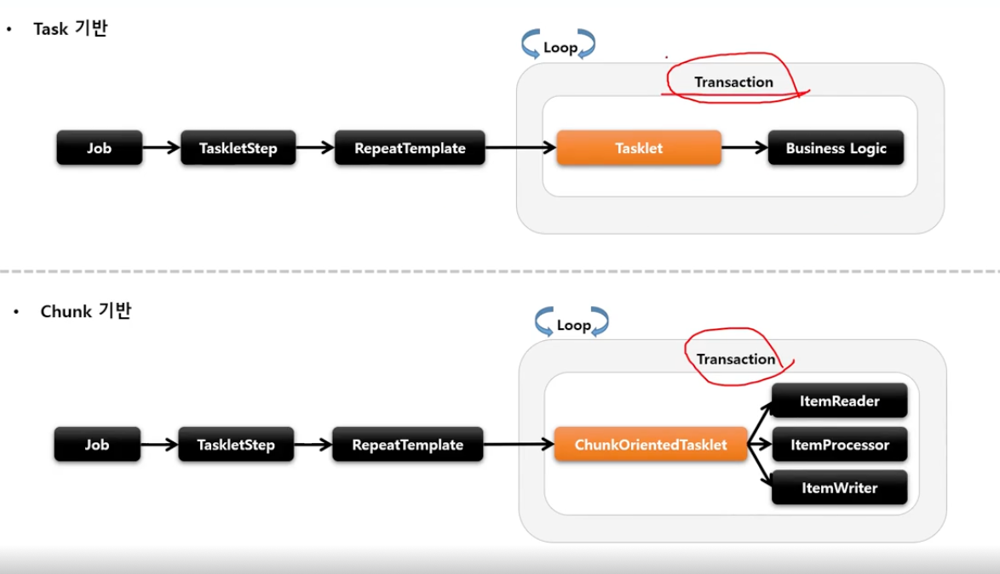
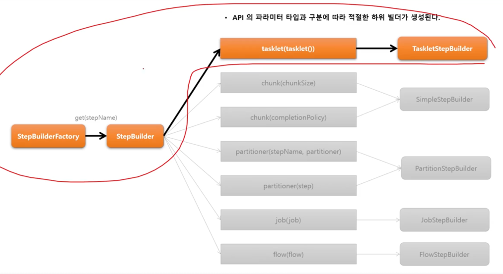

# StepBuilderFactory

- **StepBuilder 를 생성**하는 팩토리 클래스로서 get(String name) 메서드 제공
- StepBuilderFactory.get("stepName")
    - "stepName" 으로 스텝 생성

# StepBuilder

- 스텝을 구성하는 설정 조건에 따라 다섯 개의 하위 빌더 클래스를 생성하고 실제 스텝 생성을 위임한다.
    - 스텝 빌더 팩토리나, 스텝 빌더가 실제 스텝을 생성하지 않는다.
    - 실제 스텝을 생성하는 것은 스텝 빌더의 하위 빌더 클래스들이 그 역할을 한다.
-
    1. TaskletStepBuilder (`.tasklet`)

    - TaskletStep 을 생성하는 기본 빌더 클래스
-
    2. SimpleStepBuilder (`.chunk`)

    - TaskletStep 을 생성하며 내부적으로 청크 기반의 작업을 지원하는 ChunkOrientedTasklet 클래스를 생성한다
> TaskletStepBuilder 와 ChunkStepBuilder 모두 TaskletStep 을 생성한다.
> 차이점은 SimpleStepBuilder 가 청크 기반의 작업을 지원하는 ChunkOrientedTasklet 을 생성한다는 점이다.
-
    3. PartitionStepBuilder (`.partioner`)

    - PartitionStep 을 생성하며 멀티 스레드 방식으로 잡을 실행한다
-
    4. JobStepBuilder (`.job`)

    - JobStep 을 생성하며 스텝 안에서 잡을 실행한다
-
    5. FlowStepBuilder (`.flow`)

    - FlowStep 을 생성하여 스텝 안에서 플로우를 실행한다

# TaskletStep - 개념 및 API 소개

- 스프링배치에서 제공하는 Step 의 구현체로서 Tasklet 을 실행시키는 도메인 객체
- RepeatTemplate 을 사용해 Tasklet 의 구문을 트랜잭션 경계 내에서 반복해서 실행
- Task 기반과 Chunk 기반으로 나누어서 Tasklet 을 실행함

> Task vs Chunk 비교
> - 스프링 배치에서 스텝의 실행 단위는 크게 두가지로 나뉘어진다
    >
-
1. 청크 기반
>
- 하나의 큰 덩어리를 n 개씩 나누어 실행한다는 의미로, 대량처리를 위해 효과적으로 설계됨
>     - ItemReader, ItemProcessor, ItemWriter 를 사용하며 청크 기반 전용 Tasklet 인 ChunkOrientedTasklet 구현체가 제공된다
>   -
2. 태스크 기반
>
- ItemReader, ItemWriter 와 같은 청크 기반 작어봅다, **단일 작업** 기반으로 처리되는 것이 더 효율적인 경우
>     - 주로 Tasklet 인터페이스의 구현체를 만들어 사용

    >  

```java
💡 태스크릿 스텝이던,청크 기반 스텝이던 트랜잭션 내에서 수행된다.그래서 DB 와의 연동을 통한 작업 처리 시
        커밋과 롤백 등의 트랜잭션 처리가 이미 스프링배치 내부적으로 구현되어 있다.별도의 트랜잭션 처리를 위한 구문 작성이 필요없다!
```

## TaskletStep 객체가 생성되기까지...

> **StepBuilderFactory** ➡️ **StepBuilder** ➡️ **TaskletStepBuilder** ➡️ **TaskletStep**

```java
Step step1(){
        return stepBuiderFactory.get("step1") // StepBuilder 를 생성하는 팩토리. 스텝 이름을 매개변수로 받음
        .tasklet(myTasklet())           // 이 메서드를 실행하면 TaskletStepBuilder 반환
        .startLimit(10)                 // 스텝의 실행 횟수를 설정. 설정한 만큼 실행되고 초과시 익셉션. 기본값은 INTEGER.MAX_VALUE
        .allowStartIfComplete(true)     // 잡 실패 후 재 시도시, 이미 성공한 스텝은 실행되지 않는 것이 기본. 그러나 이 API 로 true 값을 주면 성공한 스텝이라 할지라도 재실행됨
        .listener(listener())           // 스텝 라이프 사이클의 특정 시점에 콜백을 제공받도록 리스너를 설정
        .build();                       // TaskletStep 을 생성
        }
```

### Task 기반으로 TaskletStep 생성

```java
Step step1(){
        return stepBuilderFactory.get("step1")
        .tasklet(myTasklet())
        .build();
        }
```

### Chunk 기반으로 TaskletStep 생성

```java
Step step1(){
        return stepBuilderFactory().get("step2")
        .<String, String>chunk(100)
        .reader().writer().build();
        }
```




